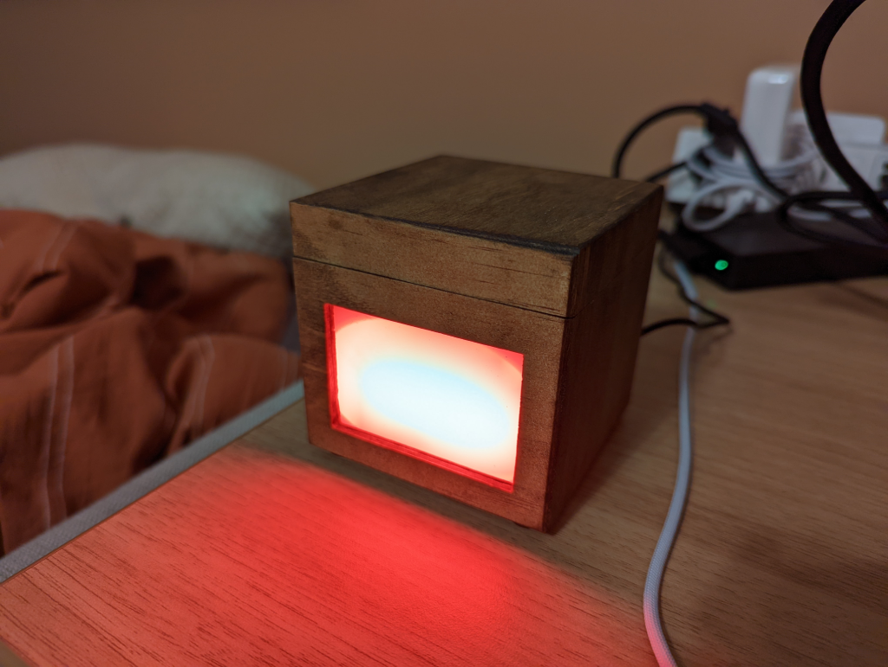

# On-Air display

Forked edits by Mike Kale <kaledev .. at .. gmail.com>

My code represents a selection of edits based upon the original code and tutorial by Jacob Verhoeks [here](https://github.com/edrans/on-air/tree/main/on-air-display) to create an on-air sign out of an ESP32 microcontroller. A MacOS/Linux laptop publishes an on-air signal to a Mosquitto broker that is received by the ESP32 and turns on or off.

There is a [complete blog post](https://www.mikekale.com/on-air-video-monitoring-device) on my website describing the process and edits in detail.

I used very similar hardware and the original circuit design still applies. The major difference is that my version updates the watch-camera shell script for newer versions of MacOS, and contains an additional script to make it Linux compatible.

The scripts can be found [here](on-air-display/watch-camera-macos.sh) for MacOS and [here](on-air-display/watch-camera-linux.sh) for Linux.

Lastly, I updated the code to glow blue when WIFI is connecting, and yellow for connecting to the Mosquitto broker.

## Description

Arduino code for an ESP32 that lights a Led strip when a message is received by MQTTClient

1. Connect to WIFI
2. Connect to MQTT Broker server
3. Subscribe to a MQTT topic
4. Loop until message is received
   a  if message is `{ "onair": 1 }` then turn led on
   b. if message is `{ "onair": 0 }` turn the led off

## Hardware

This code can work with any ESP32 with a ws2812b compatible led strips like the Adafruit Neopixel series.

Example design can be made on the excellent website <circuito.io>. Original circuit design for this forked version still applies.

<https://www.circuito.io/app?components=513,216577,360217>

## Usage

* Install the Arduino Software
* Install the ESP32 board software
* Install the required libraries
* Rename the iot.h.templ to iot.h and fill in the required fields
* Change the PIN id for the LED controller.
* Run compile and upload to the ESP32

### Required Arduino Libraries

| Library           | Author          | Reference                                       |
| ----------------- | --------------- | ----------------------------------------------- |
| MQTT              | Joel Gaelwiler  | <https://github.com/256dpi/arduino-mqtt>        |
| ArduinoJson       | Benoit Blanchon | <https://arduinojson.org/>                      |
| Adafruit_NeoPixel | Adafruit        | <https://github.com/adafruit/Adafruit_NeoPixel> |
